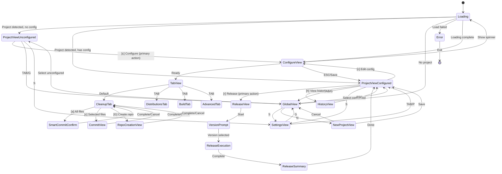

# UI State Contracts

**Last Updated**: 2025-09-29
**Status**: Updated to reflect actual implementation

## State Machine Definition



## View States

### ProjectView 🔄 NEEDS UPDATE
```go
type ProjectViewState struct {
    Project         *Project
    Config          *ProjectConfig  // nil if not configured
    SelectedAction  int
    LastRelease     *Release        // Most recent release
    QuickStats      Stats           // Downloads, issues, etc.
    GitStatus       *RepoInfo       // Current git status
}

// Two different states based on configuration

// STATE 1: Unconfigured Project (First Time)
// Shows:
// - Project detection info (name, path, git remote)
// - Big friendly prompt to configure
// - What configuration will enable (distributions, releases)
Actions (Unconfigured):
- [c] Configure project (primary action)
- [TAB] Switch view
- [ESC] Back

// STATE 2: Configured Project (Ready to Release)
// Shows:
// - Project header (name, version, path)
// - Git status (clean/uncommitted/unpushed) with color coding
// - Configured distributions (GitHub ✓, Homebrew ✓, NPM ✗)
// - Last release info (version, date, channels)
// - Quick actions prominently displayed
Actions (Configured):
- [r] Start release (primary action)
- [c] Edit configuration
- [h] View release history
- [g] Git cleanup (if uncommitted changes)
- [t] Test build
- [TAB] Switch view
- [ESC] Back

Visual Flow:
┌─────────────────────────────────────┐
│ distui v1.0.0                       │
│ /Users/dev/my-project               │
│                                     │
│ Status: ✓ All synced!               │
│                                     │
│ Distributions:                      │
│   ✓ GitHub Releases                 │
│   ✓ Homebrew (willyv3/tap)         │
│   ✗ NPM Publishing                  │
│                                     │
│ Last Release: v0.9.0 (2 days ago)  │
│                                     │
│ Actions:                            │
│ > [r] Release                       │
│   [c] Configure                     │
│   [h] History                       │
│   [t] Test Build                    │
└─────────────────────────────────────┘
```

### GlobalView
```go
type GlobalViewState struct {
    Projects        []Project
    SelectedIndex   int
    SortBy         string     // "name", "last_accessed", "last_released"
    FilterQuery    string
}

Actions:
- [↑/↓] Navigate list
- [Enter] Open project
- [n] New project
- [d] Delete project
- [/] Search filter
- [TAB] Switch view
```

### SettingsView
```go
type SettingsViewState struct {
    Config          GlobalConfig
    SelectedSection int        // 0: User, 1: Preferences, 2: UI, 3: Paths
    EditingField    *string    // Currently editing field name
    Modified        bool
}

Actions:
- [↑/↓] Navigate sections
- [Enter] Edit field
- [s] Save changes
- [r] Reset changes
- [TAB] Switch view
```

### ReleaseView 🔄 PLANNED
```go
type ReleaseViewState struct {
    Project         *Project
    Version         string
    VersionType     string     // "patch", "minor", "major", "custom"

    // Execution state
    Phase           ReleasePhase
    CurrentStep     string
    Progress        float64    // 0.0 to 1.0
    Output          []string   // Command output buffer
    StartTime       time.Time

    // Package Manager Style Progress (from charm-examples)
    Packages        []Package   // Each release step as a "package"
    Installing      int         // Current package being "installed"
    Installed       []int       // Completed packages

    // Results
    Status          string     // "running", "success", "failed"
    Error           error
    EnabledChannels []string
}

type ReleasePhase int
const (
    PhasePreFlight ReleasePhase = iota
    PhaseVersionBump
    PhaseTests
    PhaseTag
    PhaseGoReleaser
    PhaseHomebrew
    PhaseNPM
    PhaseComplete
)

// Using package-manager pattern for animated progress
type Package struct {
    Name        string
    Description string
    Status      string  // "pending", "installing", "done", "failed"
    Output      []string
}

Actions:
- [Esc] Cancel (if safe)
- [Enter] Continue (on prompts/errors)
- [v] Toggle verbose output
- [r] Retry failed step
- [s] Skip step (if non-critical)

UI Pattern:
Will use /docs/charm-examples-inventory/bubbletea/examples/package-manager
for animated progress display showing each release phase as a "package"
being installed with real-time output streaming.
```

### ConfigureView ✅ IMPLEMENTED
```go
type ConfigureModel struct {
    ActiveTab       int         // 0: Cleanup, 1: Distributions, 2: Build, 3: Advanced
    Lists           [4]list.Model
    Width           int
    Height          int
    Initialized     bool
    CurrentView     ViewType    // TabView, SmartCommitConfirm, CommitView
    Loading         bool        // Shows spinner during initial load

    // Sub-models
    CleanupModel    *CleanupModel
    GitHubModel     *GitHubModel
    CommitModel     *CommitModel

    // Repo creation state
    CreatingRepo       bool
    RepoNameInput      textinput.Model
    RepoDescInput      textinput.Model
    RepoInputFocus     int
    RepoIsPrivate      bool
    SelectedAccountIdx int
    GitHubAccounts     []GitHubAccount

    // Spinner for async operations
    IsCreating      bool
    CreateSpinner   spinner.Model
    CreateStatus    string

    // Cached status
    GitHubRepoExists bool
    GitHubOwner      string
    GitHubRepo       string
    HasGitRemote     bool
}

// CleanupModel for git management
type CleanupModel struct {
    RepoInfo         *RepoInfo
    FileChanges      []FileChange
    StatusText       string
    Width            int
    Height           int
    RepoBrowser      *RepoBrowserModel
    GitHubRepoExists bool
}

Actions (Cleanup Tab):
- [↑/↓] Navigate file list
- [Space] Toggle file action (commit/skip/ignore)
- [a] Smart commit all files
- [c] Commit selected files
- [G] Create GitHub repository
- [P] Push to remote (if unpushed commits)
- [Tab] Switch to next tab
- [Esc] Return to project view

Actions (Repo Creation):
- [Tab] Switch input fields
- [Space] Toggle visibility/account
- [Enter] Create repository
- [Esc] Cancel
```

### NewProjectView
```go
type NewProjectViewState struct {
    DetectedInfo    DetectionResult
    Project         Project
    Config          ProjectConfig
    CurrentStep     int        // 0: Detection, 1: Confirm, 2: Configure
    CanOverride     bool
}

type DetectionResult struct {
    Repository      RepositoryInfo
    Module          ModuleInfo
    Taps           []TapInfo
    Suggestions    []string
}

Actions:
- [Enter] Accept detection
- [e] Edit value
- [n] Next step
- [p] Previous step
- [s] Save and continue
- [Esc] Cancel
```

## Modal States

### ConfirmModal
```go
type ConfirmModalState struct {
    Title           string
    Message         string
    ConfirmText     string     // Default: "Yes"
    CancelText      string     // Default: "No"
    Destructive     bool       // Red coloring for dangerous actions
}

Actions:
- [y/Enter] Confirm
- [n/Esc] Cancel
```

### InputModal
```go
type InputModalState struct {
    Title           string
    Prompt          string
    Value           string
    Placeholder     string
    Validator       func(string) error
    Error           string
}

Actions:
- [Enter] Submit
- [Esc] Cancel
- [Ctrl+U] Clear
```

### ErrorModal
```go
type ErrorModalState struct {
    Title           string
    Error           error
    Details         []string   // Additional context
    Recoverable     bool
    SuggestedAction string
}

Actions:
- [Enter] Acknowledge
- [d] Show details
- [r] Retry (if recoverable)
```

## Navigation Contract

### Global Key Bindings
```go
type GlobalKeys struct {
    Quit            = 'q'      // Ctrl+C also works
    Help            = '?'
    TabNext         = '\t'
    TabPrev         = shift+'\t'

    // Direct navigation
    ProjectView     = 'p'
    GlobalView      = 'g'
    SettingsView    = 's'

    // Universal
    ScrollUp        = 'k' / '↑'
    ScrollDown      = 'j' / '↓'
    PageUp          = 'u' / 'PgUp'
    PageDown        = 'd' / 'PgDn'
}
```

### Context Preservation
- View states persist during navigation
- Scroll positions maintained
- Search queries retained
- Edit progress saved (with confirmation if unsaved)

## Event Flow

### User Input → State Update
```go
func (m Model) Update(msg tea.Msg) (tea.Model, tea.Cmd) {
    switch msg := msg.(type) {
    case tea.KeyMsg:
        switch m.currentView {
        case ProjectView:
            return m.handleProjectKey(msg)
        case GlobalView:
            return m.handleGlobalKey(msg)
        // ...
        }
    case CommandOutput:
        return m.handleCommandOutput(msg)
    case ReleaseProgress:
        return m.updateProgress(msg)
    }
}
```

### State → View Rendering
```go
func (m Model) View() string {
    switch m.currentView {
    case ProjectView:
        return m.renderProjectView()
    case GlobalView:
        return m.renderGlobalView()
    // ...
    }

    // Overlay modals if active
    if m.modal != nil {
        return lipgloss.Place(
            m.width, m.height,
            lipgloss.Center, lipgloss.Center,
            m.renderModal(),
        )
    }
}
```

## Performance Contracts

### Responsiveness Requirements
- Key press → visual feedback: < 50ms
- View switch: < 100ms
- List filtering: < 100ms
- Config save: < 500ms

### Memory Constraints
- Command output buffer: Max 10,000 lines
- Project list: Paginate after 100 items
- Release history: Keep last 10 per project
- Search results: Limit to 50 matches

## Error States

### Graceful Degradation
1. **No gh CLI**: Manual input for GitHub details
2. **No network**: Local operations only
3. **No write access**: Read-only mode
4. **Terminal too small**: Minimum 80x24 required

### Recovery Patterns
- Transient errors: Retry with exponential backoff
- Config corruption: Backup and recreate
- Crashed release: Resume from checkpoint
- Lost connection: Queue operations for retry

---

## Implementation Notes (2025-09-29)

### Completed Features ✅

#### Configure View with Tabs
- **Loading State**: Async spinner on initial load while checking git status (expensive `git ls-remote` operations)
- **Cleanup Tab**: Full git management with file categorization, smart commit, GitHub repo creation, push detection
- **Repository Browser**: Nested file navigation with centered viewport scrolling
- **Status Display**: Color-coded repository status (green=synced, yellow=unpushed, gray=labels, blue=info)

#### Git Management
- **File Categorization**: Auto-categorizes files by extension into config/code/docs/build/assets/data/other
- **Smart Commit**: AI-generated commit messages based on file changes, categorizes and commits all files
- **File-by-File Commit**: Custom commit view for selecting specific files with custom messages
- **GitHub Repo Creation**: Create repos from TUI with personal/org account selection, visibility toggle
- **Push Detection**: Detects unpushed commits even without upstream tracking (fallback to origin/main, origin/master, or count all commits)
- **Repository Sync Indicator**: Shows "✓ All synced!" when clean and pushed

#### Window Management
- **Hierarchical Sizing**: app.go → configure_handler → sub-models, each layer subtracts its chrome
- **Async Loading**: Configure view shows centered spinner during initial load, loads CleanupModel in background
- **Spinner Pattern**: Spinner ticks only when Loading or IsCreating is true, stops when done

### Planned Features 🔄

#### Project View Redesign
- **Current State**: Boilerplate placeholder content
- **Needed**: Two distinct states based on configuration status
  - **Unconfigured**: Show detection info, prompt to configure, explain what configuration enables
  - **Configured**: Show project dashboard with git status, distributions, last release, primary "Release" action
- **Integration**: Pull git status from CleanupModel, distribution config from ConfigureModel tabs
- **Visual Design**: Clean card-based layout showing status at a glance
- **Primary Actions**:
  - Unconfigured: [c] Configure is the only meaningful action
  - Configured: [r] Release is primary, [c] edit config, [h] history, [g] git cleanup if needed

#### Release View Implementation
- **Package Manager Pattern**: Use `/docs/charm-examples-inventory/bubbletea/examples/package-manager` as reference
- **Animated Progress**: Each release phase displayed as a "package" being installed
- **Live Output Streaming**: Real-time command output for each step
- **Phase Breakdown**:
  1. Pre-flight checks (validate config, check git status)
  2. Version bump (auto or manual)
  3. Run tests
  4. Create git tag
  5. Execute GoReleaser
  6. Update Homebrew tap
  7. Publish to NPM (optional)
  8. Complete with summary

#### CI/CD Workflow Generation
- **GitHub Actions**: Generate .github/workflows/release.yml for automated releases
- **Configuration**: User can choose TUI or CI/CD or both
- **Template-based**: Use goreleaser-examples and docs as reference

### Architecture Decisions

#### Why Async Loading?
The `git ls-remote` check for GitHub repo existence is slow (500ms-2s). Loading synchronously made pressing 'c' feel unresponsive. Solution: show spinner immediately, load in background.

#### Why Package Manager Pattern?
The package-manager example provides:
- Animated list of items being processed
- Real-time status updates per item
- Clean visual hierarchy
- Proven Bubble Tea pattern for long-running operations

#### Why No Script Generation?
Per constitution: direct command execution. Execute `goreleaser`, `gh`, `npm publish` directly via os/exec, stream output to UI.

### Reference Implementation Paths
- Git cleanup: `handlers/cleanup_handler.go`, `views/cleanup_view.go`
- Smart commit: `internal/gitcleanup/commit.go`
- Repo creation: `internal/gitcleanup/gh.go`
- Async loading: `handlers/configure_handler.go` LoadCleanupCmd + loadCompleteMsg
- Package manager pattern: `/docs/charm-examples-inventory/bubbletea/examples/package-manager`