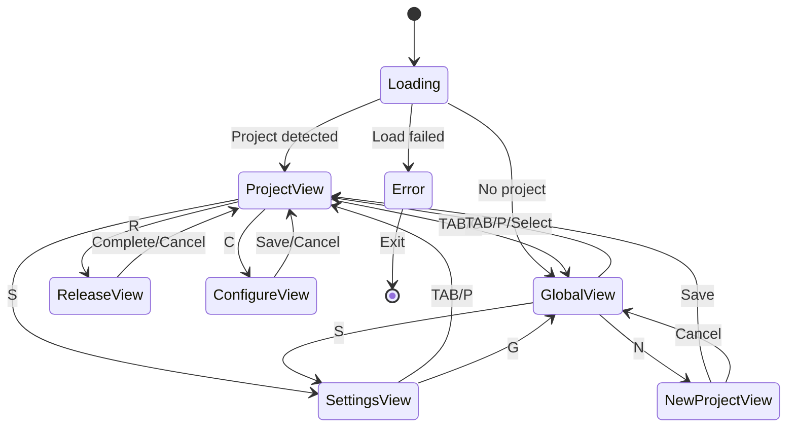

# UI State Contracts

## State Machine Definition



## View States

### ProjectView
```go
type ProjectViewState struct {
    Project         *Project
    SelectedAction  int        // 0: Release, 1: Configure, 2: History
    LastRelease     *Release   // Most recent release
    QuickStats      Stats      // Downloads, issues, etc.
}

Actions:
- [r] Start release
- [c] Configure project
- [h] View history
- [t] Test build
- [TAB] Switch view
```

### GlobalView
```go
type GlobalViewState struct {
    Projects        []Project
    SelectedIndex   int
    SortBy         string     // "name", "last_accessed", "last_released"
    FilterQuery    string
}

Actions:
- [↑/↓] Navigate list
- [Enter] Open project
- [n] New project
- [d] Delete project
- [/] Search filter
- [TAB] Switch view
```

### SettingsView
```go
type SettingsViewState struct {
    Config          GlobalConfig
    SelectedSection int        // 0: User, 1: Preferences, 2: UI, 3: Paths
    EditingField    *string    // Currently editing field name
    Modified        bool
}

Actions:
- [↑/↓] Navigate sections
- [Enter] Edit field
- [s] Save changes
- [r] Reset changes
- [TAB] Switch view
```

### ReleaseView
```go
type ReleaseViewState struct {
    Project         *Project
    Version         string
    VersionType     string     // "patch", "minor", "major", "custom"

    // Execution state
    Phase           ReleasePhase
    CurrentStep     string
    Progress        float64    // 0.0 to 1.0
    Output          []string   // Command output buffer
    StartTime       time.Time

    // Results
    Status          string     // "running", "success", "failed"
    Error           error
    EnabledChannels []string
}

type ReleasePhase int
const (
    PhasePreFlight ReleasePhase = iota
    PhaseTests
    PhaseTag
    PhaseGoReleaser
    PhaseDistribution
    PhaseComplete
)

Actions:
- [Esc] Cancel (if safe)
- [Enter] Continue (on prompts)
- [v] Toggle verbose output
```

### ConfigureView
```go
type ConfigureViewState struct {
    Project         *Project
    Config          ProjectConfig
    SelectedTab     int        // 0: Distributions, 1: Build, 2: CI/CD
    EditingField    *string
    Modified        bool
    ValidationErrors []string
}

Actions:
- [Tab] Next tab
- [Shift+Tab] Previous tab
- [↑/↓] Navigate fields
- [Space] Toggle boolean
- [Enter] Edit field
- [s] Save configuration
- [Esc] Cancel
```

### NewProjectView
```go
type NewProjectViewState struct {
    DetectedInfo    DetectionResult
    Project         Project
    Config          ProjectConfig
    CurrentStep     int        // 0: Detection, 1: Confirm, 2: Configure
    CanOverride     bool
}

type DetectionResult struct {
    Repository      RepositoryInfo
    Module          ModuleInfo
    Taps           []TapInfo
    Suggestions    []string
}

Actions:
- [Enter] Accept detection
- [e] Edit value
- [n] Next step
- [p] Previous step
- [s] Save and continue
- [Esc] Cancel
```

## Modal States

### ConfirmModal
```go
type ConfirmModalState struct {
    Title           string
    Message         string
    ConfirmText     string     // Default: "Yes"
    CancelText      string     // Default: "No"
    Destructive     bool       // Red coloring for dangerous actions
}

Actions:
- [y/Enter] Confirm
- [n/Esc] Cancel
```

### InputModal
```go
type InputModalState struct {
    Title           string
    Prompt          string
    Value           string
    Placeholder     string
    Validator       func(string) error
    Error           string
}

Actions:
- [Enter] Submit
- [Esc] Cancel
- [Ctrl+U] Clear
```

### ErrorModal
```go
type ErrorModalState struct {
    Title           string
    Error           error
    Details         []string   // Additional context
    Recoverable     bool
    SuggestedAction string
}

Actions:
- [Enter] Acknowledge
- [d] Show details
- [r] Retry (if recoverable)
```

## Navigation Contract

### Global Key Bindings
```go
type GlobalKeys struct {
    Quit            = 'q'      // Ctrl+C also works
    Help            = '?'
    TabNext         = '\t'
    TabPrev         = shift+'\t'

    // Direct navigation
    ProjectView     = 'p'
    GlobalView      = 'g'
    SettingsView    = 's'

    // Universal
    ScrollUp        = 'k' / '↑'
    ScrollDown      = 'j' / '↓'
    PageUp          = 'u' / 'PgUp'
    PageDown        = 'd' / 'PgDn'
}
```

### Context Preservation
- View states persist during navigation
- Scroll positions maintained
- Search queries retained
- Edit progress saved (with confirmation if unsaved)

## Event Flow

### User Input → State Update
```go
func (m Model) Update(msg tea.Msg) (tea.Model, tea.Cmd) {
    switch msg := msg.(type) {
    case tea.KeyMsg:
        switch m.currentView {
        case ProjectView:
            return m.handleProjectKey(msg)
        case GlobalView:
            return m.handleGlobalKey(msg)
        // ...
        }
    case CommandOutput:
        return m.handleCommandOutput(msg)
    case ReleaseProgress:
        return m.updateProgress(msg)
    }
}
```

### State → View Rendering
```go
func (m Model) View() string {
    switch m.currentView {
    case ProjectView:
        return m.renderProjectView()
    case GlobalView:
        return m.renderGlobalView()
    // ...
    }

    // Overlay modals if active
    if m.modal != nil {
        return lipgloss.Place(
            m.width, m.height,
            lipgloss.Center, lipgloss.Center,
            m.renderModal(),
        )
    }
}
```

## Performance Contracts

### Responsiveness Requirements
- Key press → visual feedback: < 50ms
- View switch: < 100ms
- List filtering: < 100ms
- Config save: < 500ms

### Memory Constraints
- Command output buffer: Max 10,000 lines
- Project list: Paginate after 100 items
- Release history: Keep last 10 per project
- Search results: Limit to 50 matches

## Error States

### Graceful Degradation
1. **No gh CLI**: Manual input for GitHub details
2. **No network**: Local operations only
3. **No write access**: Read-only mode
4. **Terminal too small**: Minimum 80x24 required

### Recovery Patterns
- Transient errors: Retry with exponential backoff
- Config corruption: Backup and recreate
- Crashed release: Resume from checkpoint
- Lost connection: Queue operations for retry